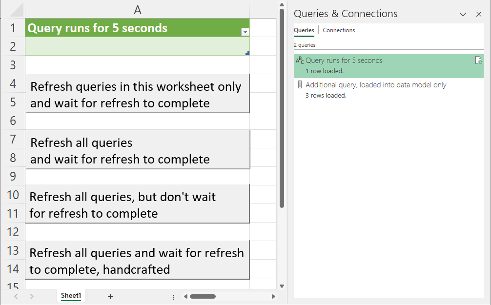

# RefreshWait.xlsm

## VBA/Excel: Wait for Power Query when using RefreshAll

Unfortunately, as of today, [Microsoft's documentation about Application.CalculateUntilAsyncQueriesDone](https://learn.microsoft.com/en-us/office/vba/api/excel.application.calculateuntilasyncqueriesdone) is misleading, if not to say wrong: "Runs all pending queries to OLEDB and OLAP data sources." No, it doesn't run them, but waits for any running queries to complete.

In a [Fork-Join model](https://en.wikipedia.org/wiki/Fork%E2%80%93join_model), Application.CalculateUntilAsyncQueriesDone is the "join" point, where Application.RefreshAll would be the "fork" point. So you need to put a call to Refresh or RefreshAll first.

The Excel macro workbook [RefreshWait.xlsm](./RefreshWait.xlsm) in this repo here demonstrates the proper usage of **Application.CalculateUntilAsyncQueriesDone**, which makes the macro wait for completion of the queries.

These macros are included:
- Macro/Sub "**WaitforWorksheetQueries**": calls "Refresh" for the queries _contained in the worksheet_ and waits for completion of the queries
- Macro/Sub "**WaitforQueries**": calls Application.RefreshAll, i.e. for _all queries in the workbook_; uses Application.CalculateUntilAsyncQueriesDone
- Macro/Sub "**DontWaitforQueries**": calls Application.RefreshAll, but doesn't wait for completion of the queries
- Macro/Sub "**RefreshAllWait**": refreshes all queries in an alternate way, waits for completion of the queries and allows for more control about the refreshing cycle, if needed

